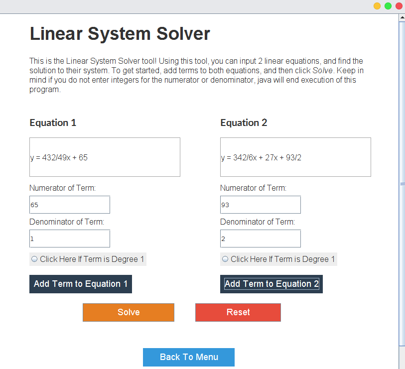
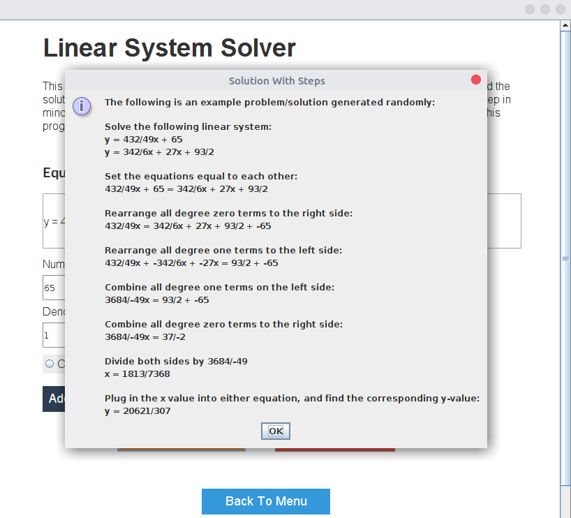
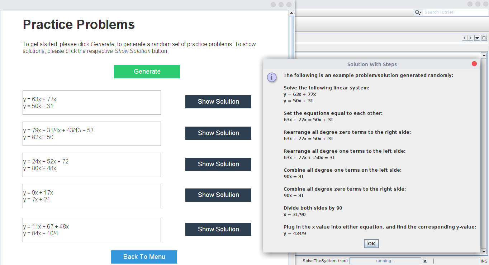
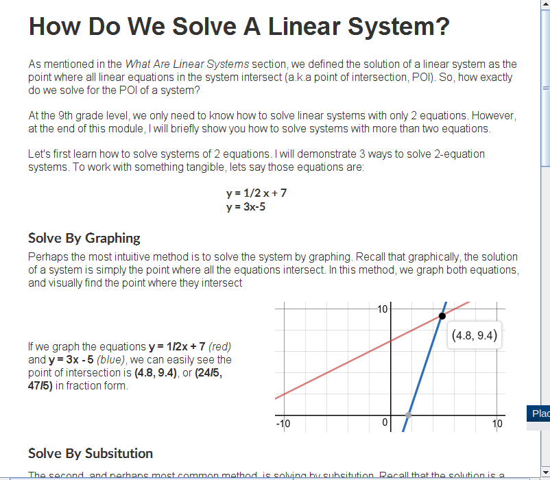

# Linear-Equation-Solver-GUI
Inspired by Wolframalpha and designed for the ICS3UO final project, I created a GUI project with the following features. It contains lessons tailored to teach 9th grade students about solving linear systems, can generate unique problem sets, and can solve any integer linear equation (assuming values can fit in a 64 bit integer) while showing steps.

Algorithmically, the program takes advantages of Arraylists, Euclid's GCD algorithm, and some miscellaneous implementation techniques.

The following are some screenshots from the program:

